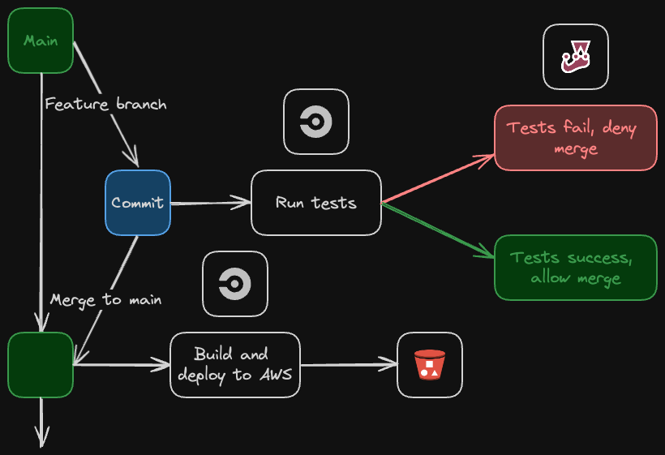

# weather-app

Over-engineered to learn some basics around Angular, CircleCI pipelines, and static site hosting on AWS. As well as getting more comfortable with Asynchronous JS.

The frontend is powered with Angular and Typescript. Since this is a static website, it will be hosted for free on an AWS S3 bucket. The infrastructure is written as code with OpenTofu.

The pipeline is configured to run with every commit to test the app using Jest. The pipeline will also fire on every merge to main so we can redeploy the latest builds to the S3 buckets. This is done completely for free using CircleCI.

A few nice things about the app are that it can be toggled from dark/light mode, and it is available in mobile view.

## CI/CD Diagram

